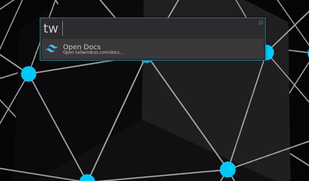

# TailwindCSS Docs Extension for Albert

[Albert](https://github.com/albertlauncher/albert) extension for quickly and easily searching the TailwindCSS documentation.




Forked from [Laravel Docs Search](https://github.com/rickwest/albert-laravel-docs) by **@rickwest**, inspired by [Laravel Docs Search](https://github.com/tillkruss/alfred-laravel-docs) for Alfred by Till Krüss.

## Requirements

You will need the `algoliasearch` [Python API Client](https://www.algolia.com/doc/api-client/getting-started/install/python/) installed on your system.

## Installation

Simply clone this project into your extension directory by running the following command:

```
git clone https://github.com/V13Axel/albert-tailwind-docs.git ~/.local/share/albert/org.albert.extension.python/modules/albert-tailwind-docs
```

## Usage

Type `tw` followed by your search query.

```
tw <query>
tw background
tw flex
tw place items center
```